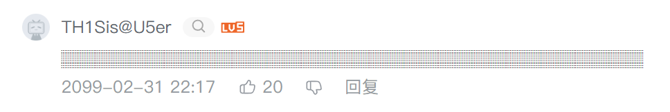

# 🐒Tamperscript
some Tampermonkey scripts

## 🙈眼不见为净

> 根据关键词屏蔽 Bilibili 评论

传送门：[script](https://raw.githubusercontent.com/U1805/Tamperscript/main/ReplyBanner.js)

代码参考：[B站成分检测器](https://scriptcat.org/scripts/code/606/B%E7%AB%99%E6%88%90%E5%88%86%E6%A3%80%E6%B5%8B%E5%99%A8.user.js)

<small>（个人仅用于屏蔽抽象低能玩烂梗复读魔怔乐子人鼠语，不针对贴吧流行语）</small>

TODO

- [ ] 正则表达式屏蔽
- [ ] 添加 toggle，方便屏蔽词增删改查

## 🚝首页排行榜

> 在首页添加「排行榜」分区，数据取自[Bilibili排行榜](https://www.bilibili.com/v/popular/rank/all) [API](https://api.bilibili.com/x/web-interface/ranking/v2?rid=0&type=all)
>
> ❗注：不适配「旧版」和当前「内测」界面 2022.10.30

TODO

- [ ] 修复右侧排行榜 Thumbnail

## 版权说明

该项目签署了MIT 授权许可，详情请参阅[LICENSE.md](./LICENSE)